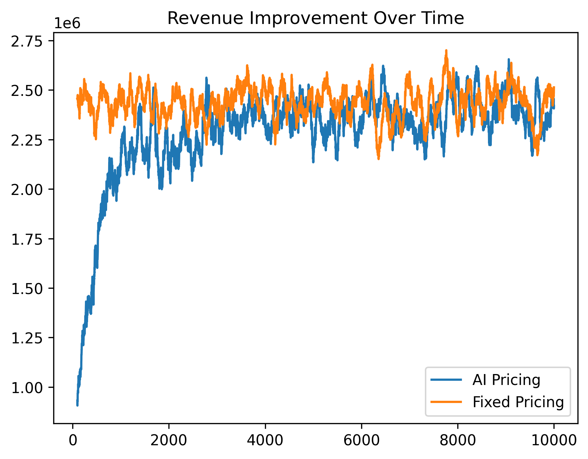

# 🧠 Adaptive Revenue Engine (ARE)

### Causal Inference + Reinforcement Learning for Autonomous Pricing Decisions

<p align="center">
  
  
  
  
  
  </p>


> A decision intelligence system that learns optimal pricing policies through causal reasoning and reinforcement learning, continuously adapting to changing market conditions to maximize long-term revenue.

---

## 🚀 Overview

Most pricing systems only answer:

> "What revenue do we expect?"

Adaptive Revenue Engine answers:

> "What price should we choose next to maximize future revenue?"

The system combines:

* 📊 Causal Inference
* 🤖 Reinforcement Learning - Contextual Bandit
* ⚡ Real-Time Decision Making
* 🔍 Explainable AI

to move beyond prediction and toward autonomous decision intelligence.

---

## 🎯 Business Problem

Pricing decisions are often made using:

* Historical averages
* Static elasticity estimates
* Manual business rules
* Forecast-only models

These approaches fail when:

* Market conditions change
* Competitor behavior shifts
* Customer preferences evolve
* Demand elasticity varies over time

ARE continuously learns and adapts pricing policies from interaction data.

---

## 🏗️ System Architecture

```text
Historical Data
       │
       ▼
 ┌─────────────┐
 │ Data Engine │
 └─────────────┘
       │
       ▼
 ┌─────────────┐
 │ Causal Layer│
 └─────────────┘
       │
       ▼
 ┌─────────────┐
 │ Environment │
 └─────────────┘
       │
       ▼
 ┌─────────────┐
 │ RL Agent    │
 └─────────────┘
       │
       ▼
 ┌─────────────┐
 │ Revenue     │
 │ Optimization│
 └─────────────┘
```

---

## 🧩 Core Components

### 📈 1. Data Generation Layer

Creates synthetic market environments including:

* Product Price
* Brand Strength
* Battery Quality
* Seasonality
* Market Noise
* Demand
* Revenue

Purpose:

* Rapid experimentation
* Safe policy learning
* Offline testing

---

### 🔬 2. Causal Inference Layer

Estimates the true impact of pricing decisions.

Example question:

> If price decreases by 10%, how much additional demand can we expect?

Outputs:

* Price Elasticity
* Treatment Effects
* Revenue Sensitivity

This separates correlation from causation.

---

### 🌎 3. Environment Layer

Simulates real market dynamics.

State variables:

```python
season
battery_quality
brand_strength
market_noise
```

Actions:

```python
increase price
decrease price
maintain price
```

Reward:

```python
revenue = demand × price
```

---

### 🤖 4. Reinforcement Learning Layer

The agent learns:

```text
State
  ↓
Action
  ↓
Revenue
  ↓
Policy Update
```

Goal:

```text
Maximize Long-Term Revenue
```

instead of immediate revenue.

Current implementation:

* Q-Learning
* ε-Greedy Exploration

Can be upgraded to:

* DQN
* PPO
* SAC
* Contextual Bandits

---

## 📂 Project Structure

```text
adaptive-revenue-engine/

│
├── README.md
├── requirements.txt
│
├── src/
│   ├── data_generate.py
│   ├── causal_inferen.py
│   ├── env.py
│   ├── rl_agent.py
│   └── train.py
│
├── data/
│
├── models/
│
└── outputs/
```

---

## ⚙️ Installation

```bash
git clone https://github.com/yourusername/adaptive-revenue-engine.git

cd adaptive-revenue-engine

pip install -r requirements.txt
```

---

## ▶️ Run Training

```bash
python src/train.py
```

Training loop:

```text
Generate Data
      ↓
Estimate Elasticity
      ↓
Create Environment
      ↓
Train RL Agent
      ↓
Optimize Pricing Policy
```

---

## 📊 Example Output

```text
Estimated Elasticity: -0.51

Episode 1000
Average Revenue: 412,315

Episode 5000
Average Revenue: 497,921

Episode 10000
Average Revenue: 562,884
```

Learned Policy:

```text
State:
(Season=2, Brand=Strong)

Optimal Price:
₹1090
```

---

## 📉 Revenue Learning Curve
---

---

## 📚 Methodology

### Demand Function

The environment models demand as:

```text
Demand =
Base Demand
− Price Effect
+ Brand Effect
+ Battery Effect
+ Seasonal Effect
− Market Noise
```

Revenue:

```text
Revenue = Price × Demand
```

---

## 🔍 Explainability

Every pricing recommendation can be traced back to:

* Estimated elasticity
* Market conditions
* Historical rewards
* Learned policy values

Example explanation:

> Price increased because recent demand became less sensitive to price changes, leading to higher expected revenue.

---

## 🛠️ Technologies

| Category         | Tools            |
| ---------------- | ---------------- |
| Language         | Python           |
| Data             | Pandas, NumPy    |
| RL               | Q-Learning       |
| Visualization    | Matplotlib       |
| Causal Analysis  | Linear Models    |

---

## 📈 Future Enhancements

### Phase 2

* DoWhy Integration
* EconML
* Counterfactual Analysis
* Causal Graph Discovery

### Phase 3

* Deep Q Networks (DQN)
* PPO
* Multi-Agent Pricing

### Phase 4

* Streaming Data
* Online Learning
* Kafka Integration

### Phase 5

* FastAPI Service
* Docker Deployment
* AWS Deployment

---

## 💡 Key Concepts Demonstrated

✔ Causal Inference

✔ Treatment Effect Estimation

✔ Revenue Optimization

✔ Reinforcement Learning

✔ Exploration vs Exploitation

✔ Decision Intelligence

✔ Policy Learning

✔ Simulation-Based Experimentation

✔ Explainable AI

---

## 👤 Author

Nithis Kumar

Data Science | Machine Learning | Reinforcement Learning | Decision Intelligence

If you found this project interesting, consider giving it a ⭐.
